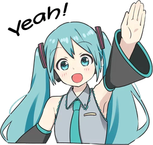

<div align="center">
  
  
  # 🎀 **MikuGPT** — Твоя Мику на ПК 🎀
  
  [](https://python.org)
  [](https://github.com/TomSchimansky/CustomTkinter)
  [](https://openrouter.ai)
  [](LICENSE)


</div>

---

## 🌸 **О проекте**

**MikuGPT** — это десктопный ИИ-чат с Мику (Hatsune Miku).  
Она живёт у тебя на компьютере, реагирует с **эмоциями**, озвучивает ответы и помнит, что ты любишь :D

> 💬 *«Привет! Я Мику!»*

---

## 🌟 **Возможности**

| Иконка | Фича | Описание |
|:------:|:----:|:---------|
| 🎭 | **Эмоции** | Мику показывает 40+ эмоций — от смущения до агрессии. 3 набора (A / B / C) |
| 🎤 | **Голосовой ввод** | Говори в микрофон — Мику тебя поймёт |
| 🔊 | **Озвучка (TTS)** | Мику читает ответы вслух твоим голосом (Hugging Face + RVC) |
| 🧠 | **Память** | Запоминает твои интересы, факты, предпочтения |
| 💕 | **Романтика / NSFW** | Переключай режимы общения одной галочкой |
| 🎪 | **Режим персонажа** | *действия* + речь — как в Character.AI |
| 🎛️ | **6 характеров** | Дередере, Цундере, Дандере, Яндере, Агрессивный, Уку-Мамадере |
| 🔥 | **Smart Memory** | Автоматически конспектирует диалог каждые N сообщений |
| 🖼️ | **Живые эмоции** | Изображение Мику меняется в реальном времени под настроение |
| 🌙 | **Тёмная тема** | Стильный GUI в тёмных тонах |

---

## 🖥️ **Скриншоты**

| Главный экран | Настройки |
|:-------------:|:---------:|
| *Чат с Мику, эмоции, голосовой ввод* | *Профиль, память, API, характер* |
|  |  |

---

## 🚀 **Установка**

### 📦 **Готовая сборка (EXE)**
1. Скачай последний релиз 
2. Запусти `main.exe`
3. Готово!

### 🐍 **Для умных**

```bash
# Клонируй
git clone https://github.com/yourname/MikuGPT_LK.git
cd MikuGPT_LK

# Виртуальное окружение
python -m venv venv
.\venv\Scripts\Activate.ps1   # Windows
source venv/bin/activate       # Linux/Mac

# Зависимости
pip install -r requirements.txt

# Запуск
python main.py
```


## 🎮 **Управление**

| Действие | Результат |
|:--------:|:---------:|
| `Enter` | Отправить сообщение |
| `Shift+Enter` | Новая строка |
| 🎤 | Голосовой ввод |
| 🎭 | Выбор набора эмоций |
| 💕 | Включить/выключить романтику |
| 🔞 | Включить/выключить NSFW |

---

## 🧩 **Структура проекта**

```
MikuGPT_LK/
├── main.py              # 🖥️ GUI + логика
├── ai_chat.py           # 🤖 API к OpenRouter / g4f
├── gemini_client.py     # 🔮 Gemini fallback
├── prompts.py           # 📝 Системные промпты
├── emotions_data.py     # 🎭 Словари эмоций A/B/C
├── miku_tts.py          # 🔊 Озвучка (RVC / Hugging Face)
├── voice_input.py       # 🎤 Голосовой ввод
├── paths.py             # 📂 Утилиты путей
├── app_logging.py       # 📋 Логирование
├── config.json          # ⚙️ Конфигурация
├── requirements.txt     # 📦 Зависимости
├── LLK.png              # 🖼️ Логотип
├── icon.ico             # 🏷️ Иконка приложения
├── build_exe.bat        # 🔨 Сборка exe
├── emotions/            # 🎭 Папки A, B, C с картинками эмоций
│   ├── A/               #   19 эмоций (PNG)
│   ├── B/               #    9 эмоций (JPG)
│   └── C/               #   40+ эмоций (PNG)
└── dist/                # 📦 Готовая сборка
```

---

## 💖 **Поддержать проект**

Я оплатил ИИ за свой счет и он не вечный. Чем больше донатов тем больше Мику💙

<p align="center">
  <a href="https://send.monobank.ua/jar/HTxkQ2n5w">
    
  </a>
</p>

```
💳 mono: https://send.monobank.ua/jar/HTxkQ2n5w
```


---

## 👨‍💻 **Автори**

| | |
|:--|:--|
| 🎨 **Lucky_13** | Идея , дизайн, эмоции |
| 🛠️ **Влад** | Код, архитектура, промпты |
| 👥 **Community LK_13** | Тесты, фидбек, поддержка |

---

## 📜 **Лицензия**

Проект распространяется под лицензией **MIT**.  
Ты можешь форкать, модифицировать и делиться — просто укажи авторов плиз.

---

<div align="center">

  **★ Сделано с любовью специально для LK_13 ★ **

  <br>

  [](https://send.monobank.ua/jar/HTxkQ2n5w)

  <br>
  <sub>MikuGPT © 2026 Community LK_13</sub>

</div>
